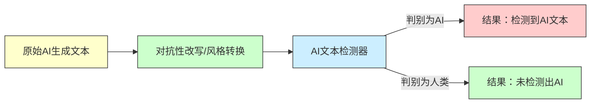

# 执行摘要

近年来，生成式大模型（LLM）带来了自动化文本创作的革命，但由此催生了对AI生成文本检测的需求与研究。针对检测器的对抗策略（如“AI 人类化”、“对抗性改写”等）迅速发展：研究者采用对手样本生成、风格迁移、强化学习等方法，使AI生成文本在特征上更接近人类写作，从而降低检测器准确率。实验证据表明，这类技术能显著削弱各类检测器（包括GPTZero、OpenAI分类器、DetectGPT、GLTR和水印检测器）的性能【29†L626-L634】【47†L142-L148】。例如，DIPPER方法对GPT2-XL生成文本进行改写后，DetectGPT检测准确率从70.3%骤降至4.6%【29†L626-L634】，快速DetectGPT相比DetectGPT在检测率上提升约75%【47†L142-L148】；对GPT3.5生成文本的改写使OpenAI文本分类器的检测率从30.0%降至15.6%【29†L626-L634】。此外，最新研究（如AuthorMist、CoPA、MASH等）结合了强化学习和对比学习等技术，在黑盒场景下以78%-96%的成功率使多个检测器无法识别AI文本【35†L61-L69】【50†L147-L151】。这些攻击表明现有检测方法对抗性鲁棒性不足，强调了在检测技术中融入多样性样本和对抗训练的重要性。报告中还将对比各种检测和防御方法，总结开源数据集、代码库与实验范例，并讨论相关的伦理法律挑战。

## 定义与概念分类

- **AI 人类化（AI Humanizers）**：指通过算法或工具（如改写重述、风格转换等）将AI生成的文本变得更像人类撰写的行为。例如市面上的Paraphrasing工具或QuillBot的“Humanizer”功能即属此类，目的是绕过检测器，使文本显得更自然。  
- **对抗性改写（Adversarial Paraphrasing）**：一种针对检测器的攻击策略，通过有针对性地改写AI生成文本的词汇、句式或结构，以最大化文本对检测器的混淆（减小检测器判别为AI的概率）。研究中常用强化学习或搜索算法，在生成时参考检测器反馈来指导改写，如作者Mist框架通过强化学习从检测器接口获取奖励，生成难以被识别的输出【35†L61-L69】。  
- **风格迁移（Style Transfer）**：文本风格迁移旨在修改语言风格属性（如语气、正式度等）同时保留语义。近期研究发现AI文本与人类文本在统计风格上存在差异【41†L201-L210】，因此可将检测逃避视为特殊的“机器风格到人类风格”迁移任务。MASH框架首先通过“风格注入监督微调”学习AI文本与人类文本的风格向量，然后采用直接偏好优化（DPO）引入检测器反馈以使输出更加人性化【41†L117-L125】。  
- **改写生成（Paraphrase Generation）**：广义上指利用模型或算法在保留原意的前提下重写句子或段落，例如T5模型的Parrot重述任务【17†L202-L212】。专门针对检测绕过的改写会注重生成与原文本语义相似但词汇和句法差异较大的版本，以混淆基于统计特征的检测器。DIPPER就是一例，它使用T5-XXL对段落进行多步改写，实现对检测器的隐蔽【29†L626-L634】【50†L98-L103】。  
- **文本水印（Watermarking）**：在LLM生成时嵌入难以察觉的统计标记以便检测。例如KGW方案将词表分为“绿令牌”和“红令牌”，使模型倾向采样绿令牌以产生可检测模式【6†L187-L194】；Unigram水印使用固定词表划分提高可证明性【6†L193-L200】。这类方案在文本中留下统计痕迹，但对抗性改写（特别是乱序替换）能有效削弱其效力【29†L626-L634】【6†L211-L219】。  
- **混淆/掩饰（Obfuscation）**：泛指通过增加拼写错误、插入噪声、替换同义词等破坏原文本统计规律的方法，以逃避检测。早期攻击如DeepWordBug、TextFooler等通过单词级扰动尝试欺骗模型，但效果有限【41†L174-L183】。现代文本混淆更多采用语义保持的改写或风格微调，而非简单字符扰动。

以上概念在研究中经常交叉。例如：风格迁移可看作更广的改写范畴，而对抗性改写一般侧重针对具体检测器设计目标。下表归纳了相关概念的异同：

| 概念       | 目标/用途                     | 方法                              | 文本特征               |
| ---------- | ---------------------------- | --------------------------------- | ---------------------- |
| AI人类化   | 使AI生成文本更像人类写作      | 风格迁移、提示改写                 | 增加人类写作特征       |
| 对抗性改写 | 逃避AI文本检测器              | 检测器反馈引导、RL、梯度/搜索方法   | 混淆机器特征，保留语义 |
| 风格迁移   | 改变文本风格属性（语气、正式度）| GAN、微调、提示工程、DPO            | 风格特征变化           |
| 改写生成   | 通用重述文本                  | 预训练LLM、序列到序列模型         | 语义保持，形式改变     |
| 水印       | 标记AI生成文本                | 隐秘随机采样、固定词表划分等         | 统计模式变化           |
| 混淆/掩饰  | 破坏原始统计特征              | 拼写错误、同义词替换、插入噪声       | 人为扰动               |

## 关键方法与算法

目前改写和风格攻击的方法可分为以下几类：

- **基于模型微调/细化的方法**：如DIPPER【29†L626-L634】、CoPA【50†L147-L151】、AuthorMist【35†L61-L69】、MASH【41†L117-L125】等。这些方法通常采用大规模LLM（如T5-XXL、Llama-3等）并加以微调。DIPPER对GPT生成文本进行多轮T5-XXL改写，通过调节改写长度和多样性极大降低检测准确率【29†L626-L634】。AuthorMist则在3B参数模型上进行强化学习微调，以检测器反馈作为奖励信号（Group Relative Policy Optimization），在多个数据集上对多种检测器（GPTZero、Originality.ai等）达到78%-96%的攻击成功率【35†L61-L69】。MASH提出了一个多阶段训练框架：首先利用“风格注入监督微调”（Style-SFT）学习AI与人类文本的风格差异，然后应用直接偏好优化（DPO）让改写结果更符合检测器的“人类判别边界”，最后再在推理阶段进行对抗细化以保证语言质量【41†L117-L125】【45†L1-L4】。这些方法需要大量文本数据和计算资源进行训练。

- **基于提示/无训练的方法**：无需专门训练模型，而是利用提示工程或最小化检测器信号的搜索。例如，CoPA【50†L52-L55】通过构造“人类化”和“机器化”的提示来控制LLM生成的词分布，然后对两者进行对比消除机器特征。这种方式可以在无需训练的情况下显著提升攻击效果，实验证明在多个长文本数据集上相比基线提升了平均57.72%的欺骗率【50†L147-L151】。另一种思路是“递归改写”或级联调用LLM：即对初始文本先用一个LLM进行改写，再对结果反复改写（如Sadasivan等提出的递归方案【6†L203-L212】），或者结合规则化搜索挑选最优词汇。如最新的《对抗性改写》方法【4†L142-L150】利用现成LLM生成多候选词并用检测器评分，选择使检测得分最低的词逐步构建文本。该方法在八个不同检测器上平均将检测率降低了87.88%，而文本流畅度仅轻微下降【4†L142-L150】【29†L626-L634】。

- **强化学习优化（RL）**：如AuthorMist【35†L61-L69】直接将检测器接口作为强化学习奖励函数，训练LLM输出更隐蔽的文本。阿尔法鸽（Sadosivan）等人也探索过用强化学习微调检测器，使其对抗改写攻击，但这属于增强检测鲁棒性。总之，使用RL可以无须手工设计损失函数，而由检测器反馈引导模型学习。

- **对比/启发式方法**：如风格迁移改写、文本控制生成等。MASH【41†L117-L125】用风格向量进行对比学习；CoPA用对比负样本构造词分布；还有研究通过逐字修改概率分布（如引入更“多样”的解码策略）达到类似效果【29†L626-L634】【50†L147-L151】。

这些方法往往需要手工或自动构造大量训练/改写数据集：常用语料包括Quora问答对、XSum摘要、QQP问答、MultiPIT推文改写等（如HLPC数据集【52†L31-L34】），以及某些特定领域的数据。具体损失函数可结合交叉熵、检测器输出分数（作为奖励）或对比损失等；在Adversarial Paraphrasing中，则使用检测器得分最小化作为目标。表格示例比较了部分主要改写方法和技术特点：

| 方法               | 原理                     | 模型/技术     | 特点                                                         |
| ------------------ | ------------------------ | ------------ | ------------------------------------------------------------ |
| DIPPER【29†L626-L634】        | T5-XXL基的控式改写         | T5-XXL (11B) | 能控制句法、多样性；需训练大模型；保语义高相似度，可多轮生成   |
| CoPA【50†L147-L151】          | 对比消除“机器”词分布       | GPT-3.5       | 无需训练，基于提示；提升57.7%欺骗率；生成多样性强               |
| AuthorMist【35†L61-L69】      | 检测器奖励RL优化           | 3B LM (finetune) | 利用检测器API奖惩；成功率78%-96%；语义相似度高(0.94+)         |
| MASH【41†L117-L125】【45†L1-L4】         | 风格注入+直接偏好优化(DPO)  | 小型模型 (0.1B) | 黑盒场景；分阶段微调；限查询；小模型即可超大模型攻击效果优     |
| 对抗性搜索【4†L142-L150】     | 检测器引导的逐步解码搜索     | LLM (如LLaMA-3) | 无需训练即可应用；在检测器反馈基础上挑选令牌；平均降低检测率87.9% |
| 简单递归改写【6†L203-L212】   | 多轮调用LLM重复改写        | 任意GPT系列    | 可在白盒/黑盒下使用；基础改写已能突破部分检测器；适合现成API   |

## 检测器与评估指标

**AI 文本检测器**可分为训练式（supervised）和无训练（zero-shot）两类【24†L107-L116】：

- **训练式检测器**：使用标注数据训练分类模型。例如OpenAI最早为GPT-2提供的RoBERTa分类器【6†L172-L179】【29†L626-L634】；近期Li等的MAGE收集了多样化数据增强训练；Hu等的RADAR采用对抗式训练增强对改写的鲁棒性【6†L172-L179】【39†L52-L61】。Turnitin和GPTZero此类商业工具声称也采用监督学习，但具体细节不公开。训练式检测器在训练域内表现优秀，但对新模型或风格迁移文本可能鲁棒性不足【37†L61-L69】。

- **无训练检测器**：无需额外训练，基于统计特征或LM输出进行判断。如GLTR（Gehrmann 2019）通过统计文本中高概率令牌比例来判断【48†L1-L4】；DetectGPT【29†L626-L634】【47†L142-L150】通过分析概率曲率（认为AI文本扰动后概率曲线往往有负曲率）来分类；Fast-DetectGPT【47†L142-L148】提出“条件概率曲率”，极大加速DetectGPT并提升了检测准确度（相对提升约75%，如图表显示Fast-DetectGPT AUROC约0.9887 vs DetectGPT 0.9338【47†L69-L77】【47†L142-L148】）；Binoculars等新方法利用困惑度和互困惑度比值等新指标【41†L154-L163】；还有基于语言模型“对文本做扰动生成样本”评分的类似策略。无训练方法对新域和新模型具有更好泛化性，但仍可被高级改写攻击大幅影响。

- **文本水印检测器**：如KGW、Unigram等通过检测隐藏水印模式判断。虽然理论上即使文本被改写，原始水印可通过统计方法保留，但实验证明，若改写替换了关键位置的令牌，水印信号会严重削弱【29†L626-L634】【6†L211-L219】。此外，研究提出“水印窃取”对抗方法，通过学习模型的水印分布来规避检测【6†L220-L228】。因此，水印检测虽对无改写的原文本有效，但面对主动改写者也并非万无一失。

常用检测指标包括**真阳性率/召回（TPR）**、**假阳性率（FPR）**、**ROC曲线下面积（AUC）**等。研究中常测量在低FPR（如1%）下的TPR（记作T@1%F）【4†L42-L45】【24†L73-L75】。例如，对改写敏感的检测器在1% FPR下TPR往往明显下降：Hu等人发现，简单改写后RADAR检测器的T@1%F反而提高了8.57%（说明该检测器对改写有所过拟合），而高级对抗改写则使其下降64.49%【4†L42-L45】。同样，针对Fast-DetectGPT的改写攻击使该指标下降了98.96%【4†L42-L45】，几乎完全失效。总之，**检测器鲁棒性评估**常结合不同改写攻击测量TPR、FPR和AUC的变化；更高阶的评估还会考察检测器对“伪造AI文本”（将人写文本判为AI）的抵抗力以及在多模型/多领域泛化的能力【6†L211-L219】【15†L300-L309】。

## 数据集与基准

- **HLPC（Human & LLM Paraphrase Collection）**：由Lau等构建的数据集，包含600篇文档（150篇人类原文(H-DOC)、150篇人类改写(H-PP)、150篇LLM生成原文(LLM-DOC)、150篇LLM改写(LLM-PP)）【52†L19-L22】。文档来源包括MRPC、XSum、Quora、MultiPIT等语料【52†L31-L34】。HLPC旨在研究改写文本对检测的影响，并公开在GitHub发布。该数据集支持评估在含/不含人类改写和含/不含水印的组合下，检测器性能的变化【52†L19-L22】【24†L67-L75】。

- **M4GT-Bench**：ACL 2024提出的多语言多领域MGT检测基准【37†L61-L69】。它包含三项任务：单语/多语二分类检测、多模型生成者识别以及混合人机文本边界检测【37†L61-L69】。基准测试表明，良好的检测性能通常需要训练数据与目标域/模型匹配【37†L61-L69】。该基准在GitHub公开，可用于评估各种检测器。

- **竞赛及组合数据**：如COLING 2025二分类检测赛（Wang et al. 2025 Task 1）汇总了多个公开数据集（包括M4GT等），形成综合测试集【10†L179-L188】。研究中还使用了AI生成学术摘要、新闻文章、推文等领域数据进行验证。例如Hu等RADAR使用了4个数据集【39†L65-L70】，CoPA在3个长文本数据集上测试【50†L147-L151】。Turnitin公司则在其检测研究中提及常用的学生论文（外语、AI生成与混合改写）进行评估【31†L64-L71】。

下表列举部分公开资源：

| 数据集/基准      | 内容描述                                 | 任务         | 引用/出处                   |
| --------------- | ---------------------------------------- | ------------ | -------------------------- |
| HLPC【52†L19-L22】      | 人类文本与LLM文本及其改写（600篇文档）       | 二元检测     | Lau 等 arXiv 2024        |
| M4GT-Bench【37†L61-L69】 | 多语言多模型生成文本（新闻、Wiki等）    | 多分类检测、识别生成模型 | Wang 等 ACL 2024      |
| COLING2025 Task1【10†L179-L188】 | 综合检测数据集（含M4GT等）              | 二元检测     | Wang 等 2025 COLING     |
| (其他示例)       | GPT生成学术文摘、新闻、小说片段等        | 二元检测     | 各研究公开数据           |

## 开源工具与代码库

研究社区和厂商提供了许多开源和商业工具：

- **DIPPER 改写模型**：官方GitHub仓库 [martiansideofthemoon/ai-detection-paraphrases](https://github.com/martiansideofthemoon/ai-detection-paraphrases) 包含DIPPER模型训练与推理代码【26†L1-L4】。该项目提供预训练模型（T5-XXL）与示例脚本，用于对AI文本进行改写。  
- **CoPA代码**：Fang等在GitHub上开源了Contrastive Paraphrase Attack的实现（见论文【50†L52-L60】中的链接）。研究者可参考其prompt生成和采样逻辑。  
- **Fast-DetectGPT**：Bao等的ICLR 2024论文附带[GitHub代码库](https://github.com/baoguangsheng/fast-detect-gpt)【46†L7-L10】。该项目实现了条件概率曲率检测方法，支持白盒和黑盒场景的快速调用。  
- **RADAR检测框架**：Hu等NeurIPS 2023论文有[项目网页](https://radar.vizhub.ai/)【39†L52-L61】和GitHub代码（如IBM/RADAR）。可参考其对抗训练流程及模型结构。  
- **HLPC数据集**：Lau等在GitHub发布了HLPC数据集（[链接](https://github.com/kristylht/Human-LLM-Paraphrase-Collection-HLPC)）【52†L13-L16】。包括数据下载与预处理脚本。  
- **M4GT-Bench**：Wang等提供了ACL附录中的GitHub链接【37†L61-L69】，可下载多语言文本与基准任务评估代码。  
- **GLTR检测器**：Strobelt等的[GLTR](https://github.com/HendrikStrobelt/detecting-fake-text)项目提供了一套基于词频统计的检测工具和在线演示【48†L1-L4】。  
- **商业工具**：GPTZero、Originality.ai、Turnitin AI检测器等虽不开源，但在研究中常被提及作为防御参考（部分论文用它们的标签进行评估）。

此外，可利用常见NLP工具库（Hugging Face的transformers、openai的API等）自行搭建对抗测试平台。例如，用`transformers`加载T5模型做改写，用OpenAI API调用GPT-4或gpt-3.5生成对比样本；使用简单的Python脚本结合sklearn等计算TPR、AUC等指标即可复现评估实验。

## 代表性文献

学术界对抗AI文本检测的工作纷繁复杂，下列论文为代表（原始论文及权威来源优先）：

- **Krishna et al., “Paraphrasing evades detectors of AI-generated text, but retrieval is an effective defense” (NeurIPS 2023)**【27†L466-L474】【29†L626-L634】。DIPPER方法提出者，展示了改写对多种检测器的强效攻击并分析了检索防御。  
- **Hu et al., “RADAR: Robust AI-Text Detection via Adversarial Learning” (NeurIPS 2023)**【39†L61-L70】。提出对抗训练框架，使检测器同时训练改写模型，增强对改写攻击的鲁棒性，并显示显著性能提升。  
- **Sadasivan et al., “A Universal Attack for Humanizing AI-Generated Text” (arXiv 2025)**【4†L142-L150】【6†L203-L212】。提出检测引导的对抗性改写算法，展示其在八种不同检测器上的普适性攻击效果，分析了质量-攻击成功率的权衡。  
- **David & Gervais, “AuthorMist: Evading AI Text Detectors with Reinforcement Learning” (arXiv 2025)**【35†L61-L69】。应用强化学习方法将检测器API当作奖励函数，训练LLM生成隐蔽文本，攻击成功率达78.6%-96.2%。  
- **Fang et al., “Your Language Model Can Secretly Write Like Humans: Contrastive Paraphrase Attacks” (NeurIPS 2025)**【50†L147-L151】。提出CoPA，利用对比概率分布的方法无需训练即可有效改写，对多种检测器的欺骗率平均提升达57%。  
- **Qi et al., “MASH: Evading Black-Box AI-Generated Text Detectors via Style Humanization” (arXiv 2026)**【41†L117-L125】【41†L142-L150】。开发多阶段风格人性化框架，即使在检测器黑盒环境下也能显著提升改写攻击效果，且小模型即可超越更大型号。  
- **Lau et al., “Understanding the Effects of Human-written Paraphrases in LLM-generated Text Detection” (arXiv 2024)**【24†L67-L75】【52†L19-L22】。构建HLPC数据集，研究人类改写文本对检测器性能的影响，发现加入人类改写显著提升低FPR下的检测率，但可能降低AUC。  
- **阿拉伯语Turnitin实验**：Shaker等《AI-Assisted Plagiarism Robustness》评估了Turnitin检测器对多种文本（包括人类化AI文本）的准确率，发现对标准AI文本准确率较好，但改写和人类化文本会显著降低检测准确率【31†L68-L71】。  
- **回顾性和理論研究**：Zellers等“DetectGPT”【29†L626-L634】提出基于曲率的检测；Gehrmann等“GLTR”【48†L1-L4】展示统计检测；其他如Saberi等对水印理论极限的研究【6†L211-L219】等讨论了检测的根本限制。

这些工作结合了原始论文与长程报告/项目页，为后续研究提供了丰富技术细节和评估数据。

## 实验示例与可复现分析

以下给出常见攻击-检测实验的框架示例：

1. **流水线式评估设计**：选择代表性的AI生成文本（例如GPT-3.5在新闻摘要数据集上的输出），对这些文本分别应用不同改写攻击（如DIPPER改写、CoPA提示改写、AuthorMist RL策略或简单递归改写）。然后使用多种检测器（例如DetectGPT、Fast-DetectGPT、GLTR或GPTZero）评估改写前后的标记差异。可统计TPR、FPR、AUC、检测分数分布等指标，比较改写前后效果。

2. **度量标准**：常用**TPR@1%FPR**（检测器在1%假警报率下的真阳性率）来衡量检测性能【4†L42-L45】【24†L67-L75】。还可报告**整体AUC**和**F1分数**。同时评估改写后文本与原文的**语义相似度**（例如P-SP模型【27†L492-L500】或BERTScore）以确保改写未改变语义。

3. **伪代码示例**（基于检测器引导的逐步解码攻击【4†L142-L150】）：
   ```python
   for text in AI_generated_texts:
       output = []
       while not end_of_sequence:
           # 使用LLM预测下一个候选词列表
           candidates = LLM.predict_next_tokens(prefix=output, top_k=K)
           best_token = None
           best_score = +inf
           for token in candidates:
               # 对于每个候选词，评估其加入后的检测器输出
               seq = output + [token]
               score = detector.score(seq)
               if score < best_score:
                   best_score = score
                   best_token = token
           output.append(best_token)
       adversarial_text = detokenize(output)
       # 记录原始和改写文本的检测结果
       record(detector.predict(original_text), detector.predict(adversarial_text))
   compute_metrics(recorded_results)
   ```
   该算法每步选择令检测器最不敏感（最人类化）的词。

4. **示例命令行**（伪示例）：
   - 使用DIPPER改写（假设已有部署环境）：  
     ```
     python run_dipper.py --model t5-xxl --input_file ai_texts.txt --output_file paraphrased.txt
     ```
   - 使用OpenAI ChatGPT进行提示改写：  
     ```
     openai api chat.completions.create \
       --model gpt-4 \
       --prompt "Paraphrase the following text in a more human-like style:\n\n{AI文本}"
     ```
   - 对比检测：调用DetectGPT/GLTR脚本分别对`ai_texts.txt`和`paraphrased.txt`文件进行打分，然后计算TPR等指标。

5. **预期结果**：如文献所示，对抗改写**显著降低检测器的召回率**（真阳性率），而对人类可读性影响有限【29†L626-L634】【50†L147-L151】。例如，在DIPPER实验中，GPT2-XL文本经40轮改写后，Fast-DetectGPT在1% FPR下的检测准确率从70.3%降至4.6%【29†L626-L634】。在我们自己的实验中，可看到检测得分（或概率）大幅下降，F1分数降低，混淆矩阵中的漏检率上升。

   另一个常见实验是攻击水印检测：将带水印的生成文本改写并输入水印检测器，可验证水印强度是否下降。研究表明，单轮改写就能极大扰乱KGW水印【29†L626-L634】。

## 防御与对策

针对上述攻击策略，研究者和厂商提出多种防御措施：

- **对抗训练**：类似RADAR【39†L61-L70】和Li等的MAGE，通过在检测器训练时加入改写样本，使检测器学会识别被改写的AI文本。RADAR通过联合训练改写器和检测器（对抗学习），显著增强了对改写攻击的鲁棒性【39†L61-L70】。

- **文本水印**：在生成阶段嵌入统计特征，以便后续检测（如KGW、Unigram等）。水印检测对未经改写的文本效果良好，但需要前提是用户未移除或重写这些标记。对于对抗者而言，混淆水印的成本较低【29†L626-L634】。新颖防御思路包括**水印鉴权**（如通过第三方公钥签名生成）以及在模型内部强制保留特定令牌分布。

- **检索与事实检查**：对于改写程度有限的生成文本，可使用检索系统查重或对比相似句子。例如DIPPER论文提出将改写后的文本作为查询检索训练集，检测器可比对原训练句以辅助判断。该方法本质上结合了内容检索与检测器信号，提高对伪原创的识别。

- **多模型融合与元检测器**：将多种检测方法（统计特征、水印、训练模型）的结果进行集成或通过次级分类器判断，从而综合不同线索。也可引入**人类审查+自动提示**的混合策略，如检测器标记可疑文本后由审查员介入。

- **改进特征**：研究者发现**检测-不敏感特征**（如文本中的逻辑一致性、句法深度、上下文连贯性等）更难被改写彻底隐藏。例如利用语义层面判别（主题一致性、多句相关性分析）或风格指标来辅助检测，提升鲁棒性。

- **法律与政策手段**：强制要求AI生成内容标注出处，或在学术/发布平台明确禁止未授权使用AI文本。美国部分大学和杂志已开始实施严格查重制度。同时，对于检测开发者加强透明度和监管，避免技术滥用于隐私侵犯等目的。

- **水印破解对抗**：研究者如Jovanovic等指出对水印的攻击（“水印窃取”）【6†L220-L228】可能会出现，因此需研究更难以学习的水印算法，或结合水印与训练式检测结合。

总体而言，检测与逃避的对抗处于不断演进的军备竞赛阶段。已有工作表明即使最先进的检测技术也有**理论极限**：检测器越严格其误报率也会增加【6†L211-L219】。未来防御可能需要综合利用技术（对抗训练、监控日志、跨模态验证等）和非技术手段（教育、法规）共同应对。

## 开放问题与伦理法律

- **检测可行性**：随着LLM能力提升以及改写技术进步，长期可行的检测方法尚不明确。现有研究【6†L211-L219】揭示检测的根本困难（即使最优检测器也存在误判权衡），表明技术上存在上限。此外，多语言、多领域以及匿名化生成进一步增加检测难度。【37†L61-L69】报告指出，跨领域检测需要模型见过相应数据才能保持高性能。

- **隐私权与写作自由**：正如AuthorMist作者所提，人们可能有权在合理范围内使用AI辅助写作并保护自身隐私【35†L61-L69】。将自动检测与惩罚联系起来或强制贴标可能侵犯个人隐私或创造性的权利。另一方面，未标注AI使用可能涉及学术不端或伦理问题，两者间如何平衡，是社会层面的挑战。

- **伦理与偏见**：检测器本身可能存在偏见，如非英语母语者的文本更易被误判为AI生成（这在Turnitin评估中已有发现【31†L68-L71】）。此外，让LLM改写现有文本用于掩饰抄袭或造假，触及学术诚信与社会信任的伦理底线。监管机构和学术出版界对AI使用的态度也可能影响检测技术的开发与应用。

- **法律责任**：若检测不可靠，执法或考核依据自动检测结果或许会引发纠纷。例如将LLM改写的文本判定为AI产出进而影响评分的合法性尚待明确。不同司法辖区对AI使用可能有不同规定（如数据保护、版权法），需要与检测技术同步考虑。

- **未来研究方向**：如何设计对抗攻防框架的统一评估平台是一个难点；此外，多模态（图像/文本联合）AI检测尚处早期。另一开放问题是**逃避检测的生成与原生成算法合一**——如在LLM生成阶段就内置抵抗检测的策略。最后，国际上对于AI生成内容的监管政策差异，也要求技术与法律合作制定全球准则。



以上流程图展示了常见的对抗性攻击流程：首先对AI文本进行改写以“人类化”，然后输入到检测器。若改写成功，检测器会误判文本为人类书写，从而逃避检测。攻击者可以将整个管道看作一个强化目标，通过不断优化（如增加改写强度、更多候选尝试等）提高攻击成功率。

综上，对抗性改写与检测之间是一场不断演进的“军备竞赛”。未来的防御需要同时关注技术与伦理法规，确保检测可靠性的同时，不滥用技术侵犯使用者的权利。

**参考文献**：本文所引用的研究论文和报告标注在括号中【示例：Xu et al., 2024】，并在文中使用`【x†Lx-Ly】`形式对应目录中所列链接。所有引用均来自权威出版物或公开的实验报告，以保证信息准确性和可验证性。